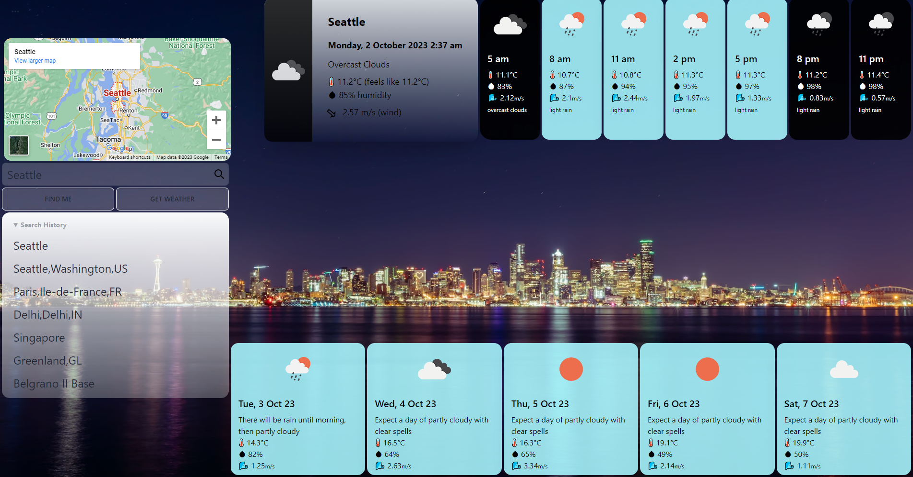
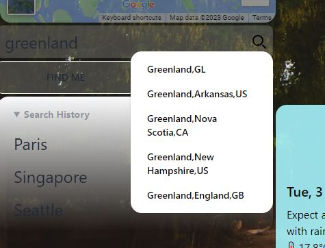
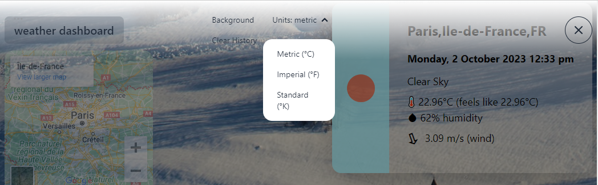
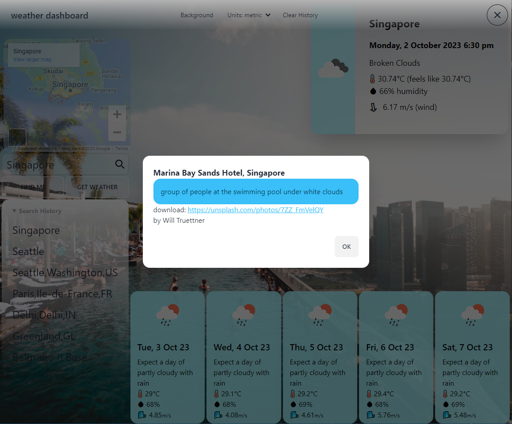

# Weather Dashboard

Link: [https://andrenrwn.github.io/weatherdashboard/](https://andrenrwn.github.io/weatherdashboard/)

Repo: [https://github.com/andrenrwn/weatherdashboard](https://github.com/andrenrwn/weatherdashboard)

## About

This weather dashboard presents the current weather and a 5-day weather forecast for a selected city.

## Screenshots

## Features and Functionality

- Clicking "Find Me" queries the user's browser's location into the text input

- The search icon brings up a selection of locations via the Openweathermap API city data
  

- Clicking on the "Get Weather" button takes the text input and gets the current day's weather, the day's 3-hour weather forecast, and the 5-day future weather forecast using OpenWeatherMap's API. The map will be updated to the selected location.

- Clicking on the current weather's card will hide the day's 3-hour forecast cards.

- The selected city name is stored in the search history list. If previously selected, the search term is brought to the top of the search history.

- The search history is saved in the browser's localStorage.

- The search history can be cleared using the menu navbar

- Weather time and date uses the destination City's timezone

- Users can choose among three systems of measurement from the menu:
  "metric" > Metric (°C)
  "imperial" > Imperial (°F)
  "standard" > Standard (°K)

  

- A context relevant random background image from Unsplash.com is displayed when the user selects a location.

- The background image information can be queried using the "Background" menu selection.

  

## Components and Credits

OpenWeather API [https://openweathermap.org/api](https://openweathermap.org/api)

Unsplash API [https://unsplash.com/documentation](https://unsplash.com/documentation)

Google Maps Embed API [https://developers.google.com/maps/documentation/embed/get-started](https://developers.google.com/maps/documentation/embed/get-started)

Tailwind CSS [https://tailwindcss.com/docs/](https://tailwindcss.com/docs/)

DaisyUI Components [https://daisyui.com/](https://daisyui.com/)

